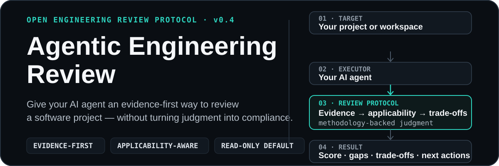

<p align="center">
  
</p>

# Agentic Engineering Review

> 让你的 AI Agent 基于真实项目证据，对软件项目进行适用性自适应的结构化工程 Review，并给出诊断评分、关键 trade-off 与下一步行动。

[English](README.md)

> **当前状态：v0.4 — 私有孵化。** Review Protocol 与底层方法论正在真实项目中持续验证。本项目是一套具有明确工程取向的开放 Review 系统，而不是行业标准、认证体系或合规框架。

## 用一句话审查你的项目

只要 AI Agent 能够访问本仓库与目标项目，就可以直接发送：

> **请使用 `https://github.com/Charlie-Wang-03/Agentic-Open-Source-Engineering-Methodology` 中的 Agentic Engineering Review 审查 `<TARGET_PROJECT>`。先读取并遵循 `AGENT_REVIEW_PROTOCOL.md`；检查实际项目证据，判断哪些审查维度真正适用，给出结构化 Diagnostic Score 与有证据支持的发现；除非我明确要求，否则不要修改目标项目。**

`<TARGET_PROJECT>` 可以是：

- Agent 当前打开的本地 workspace；
- 本地项目目录；
- GitHub 或其他远程仓库；
- Agent 确实有权读取的私有或内部项目；
- 拥有足够可访问证据的非 Git 项目。

canonical、工具无关的执行协议是 [`AGENT_REVIEW_PROTOCOL.md`](AGENT_REVIEW_PROTOCOL.md)。审查默认 **只读**。

## 你会得到什么

一次正常 Review 会给出：

- 在证据覆盖充分时给出的、适用性自适应的 **0–100 Diagnostic Score**；
- 显式的 **Evidence Coverage**，让缺失证据被看见，而不是被 Agent 猜测填补；
- 当前最值得修复的高价值工程缺口；
- 应当保留的合理 trade-off；
- 需要更多证据才能判断的问题；
- 修复成本暂时高于收益、因此主动 defer 的问题；
- 3–5 个有优先级的下一步行动。

分数只是诊断摘要，不是认证，也不用于机械比较不同类型的项目。

## 它如何工作

```text
Target Project
    ↓
你的 AI Agent
    ↓
Agent Review Protocol
    ↓
Evidence → Applicability → Engineering Judgment → Trade-offs
    ↓
Structured Review
```

Protocol 要求 Agent：

1. 先确认自己真正能够读取哪些项目状态与证据；
2. 在评价之前理解项目目的、用户、约束与成熟度；
3. 检查真实实现证据，而不是只相信项目宣传或 README 声明；
4. 每个审查维度先判断 `Material`、`Relevant` 或 `N/A`，之后才能评分；
5. 证据不足时使用 `NE — Not Enough Evidence`，而不是猜分；
6. 区分真正工程缺口与合理的非默认 trade-off；
7. 除非用户另行授权，否则始终保持只读。

## 面向高度使用 Agent 的真实项目开发

Agentic Engineering Review 尤其适合：

- **AI-native builders** — 大量依赖 Coding Agent 的独立开发者与工程师；
- **technical product builders** — 直接参与原型、项目仓库和 Agent 工作流的 AI 产品经理、原型开发者与独立 AI 开发者；
- **FDE / solution engineers** — 经常面对客户环境、部署约束、provider、权限、数据边界与快速变化需求的工程人员；
- 希望提高 Human-Agent Collaboration 工程质量、但不希望引入重型合规流程的维护者。

目标项目不要求开源。与项目真实目标无关的审查维度直接标记为 `N/A`，而不是扣分。

## 为什么它不同

### Evidence before judgment

Agent 应优先检查实现、配置、tests、CI、依赖、历史、runtime evidence 或其他相关项目材料，再做宽泛判断。

### Applicability before scoring

系统不会强迫所有项目接受同一套 checklist。一个明确保持私有的内部项目，可以合理地把开放协作维度标记为 `N/A`；一个纯静态文档项目，也可能不存在有意义的 local / remote runtime boundary。

### Trade-offs, not compliance

偏离默认原则不自动等于缺陷。对于重要非默认选择，使用：

`Default → Conflict → Trade-off → Exception → Evidence → Revisit`

只要真实约束与证据支持，专有 solver、云平台或特定 provider 都可能是正确工程选择。

### Agent-executable, human-accountable

Protocol 被设计为可由具备读取能力的 AI Agent 直接执行，但工程责任仍然由人承担。Agent 提供结构化判断支持，而不是替代最终工程决策。

## 诊断评分

每个可能适用的维度首先获得 applicability 状态：

| Applicability | 含义 | 权重 |
| --- | --- | ---: |
| `Material` | 实质影响项目结果或风险 | 2 |
| `Relevant` | 值得审查，但属于次要因素 | 1 |
| `N/A` | 对项目没有实质意义 | 不计入 |

证据充分的适用维度按 `0–4` 分评分，并标记 `High`、`Medium` 或 `Low` 证据置信度。适用但证据不足的维度标记为 `NE`，不得猜测数字分数。

只有加权 **Evidence Coverage ≥ 70%** 时，才给出 `/100` 的总体 Diagnostic Score。完整规则见 [Agent Review Protocol](AGENT_REVIEW_PROTOCOL.md) 和面向人类阅读的 [项目审查模板](templates/PROJECT_REVIEW.zh-CN.md)。

## 由 Agentic Engineering Methodology 驱动

Review 系统背后是一套同时面向人类与 Agent 可读的工程方法论。

最高元原则是 **Outcomes over Dogma**：

> **项目结果优先。原则用于改善工程判断，而不是替代工程判断。**

当前九条核心原则：

1. **Open by Default — 开放优先**
2. **Agent-Native, Human-Accountable — Agent 原生，人类负责**
3. **Portable over Model-Agnostic — 追求可移植，而非绝对模型无关**
4. **User Sovereignty & Privacy by Default — 用户主权与默认隐私保护**
5. **Local-First When Practical — 合理情况下本地优先**
6. **Justified Dependencies — 每个依赖都必须证明自己的价值**
7. **Progressive Usability — 渐进式用户友好**
8. **Verifiable by Default — 默认可验证**
9. **Reversible Change — 修改应尽可能可逆**

这些原则有意同时包含长期价值、工程默认偏好、约束、决策准则与优先采用的手段；它们会根据目标项目的真实目的与约束选择性应用。

## 两种使用方式

### 1. 外部 Review — 默认方式

让本仓库保持在目标项目之外，只在真正有价值的节点调用，例如：

- 项目开始进入认真开发阶段；
- 重大架构或依赖决策；
- 大规模重构；
- 准备公开发布；
- 重要 Release；
- 事故、失败或明显工程问题之后。

正常外部 Review 不会在目标项目中留下任何方法论专属文件。

### 2. 选择性落地 — 确有价值时

如果 Review 暴露出反复出现的项目特定需求，只把这些需求转化为目标项目自己的工程产物。例如：

- 当 Coding Agent 上下文确实不足时，参考 [`templates/AGENTS.md.template`](templates/AGENTS.md.template)；
- 某个高影响决策需要长期保留依据时，使用 [Decision Record](templates/DECISION_RECORD.md)；
- 因为项目本身需要而增加 tests、validation、safeguards 或 documentation，而不是为了提高方法论分数。

不要把整套方法论机械复制进每一个项目。

## 深入了解

| 资源 | 作用 |
| --- | --- |
| [`AGENT_REVIEW_PROTOCOL.md`](AGENT_REVIEW_PROTOCOL.md) | canonical Agent 执行协议与输出契约 |
| [核心原则](docs/principles.zh-CN.md) | 相对稳定的工程默认与价值取向 |
| [决策框架](docs/decision-framework.zh-CN.md) | trade-off、例外、证据与 revisit 规则 |
| [实践指南](docs/practices.zh-CN.md) | 变化更快的工程落地实践 |
| [方法论治理](docs/governance.zh-CN.md) | 方法论和 Review Protocol 如何演化 |
| [项目审查](templates/PROJECT_REVIEW.zh-CN.md) | 面向人类的审查维度与评分 rubric |

## 边界

Agentic Engineering Review **不是**：

- 安全认证或专业安全审计的替代；
- 合规框架；
- 软件质量保证；
- 用于跨不同项目类型机械排名的通用成熟度 benchmark；
- 要求所有项目使用相同模型、Agent、平台或技术栈的规范；
- 因为用户提出“review”就自动获得修改目标项目的权限。

如果 Agent 无法访问重要的方法论内容或目标项目证据，应明确报告限制并降级审查，而不是伪造完整性。

## 仓库状态

本仓库本身也是 Review 系统与底层方法论的考察对象。它有意保持 Markdown-first，只使用轻量 Python 标准库 validator，而不建立重型文档工具链。

验证命令：

```bash
python3 scripts/validate_repo.py
```

英文是默认操作语言；README 与核心方法论文档提供完整简体中文一等阅读路径。canonical Agent Review Protocol 保持 English-first，而 Review 输出通常应跟随用户语言。

仓库在孵化阶段继续保持私有。首次公开前应专门完成方法论、文档、隐私、Git 历史、治理以及跨 Agent Protocol 行为验证。

## 参与贡献

参见 [CONTRIBUTING.md](CONTRIBUTING.md)。贡献应优先改善真实工程判断、Review 可靠性或采用体验，而不是为了完整性增加流程。

## License

本项目采用 [Apache License 2.0](LICENSE)。
